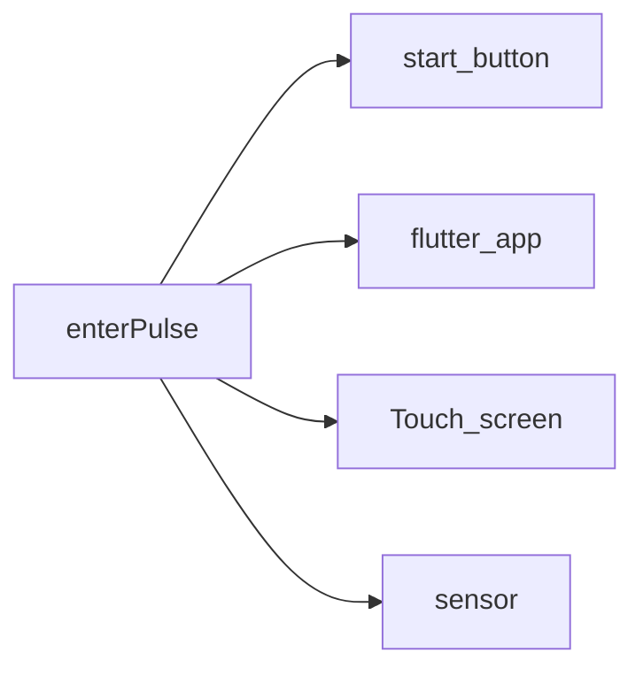
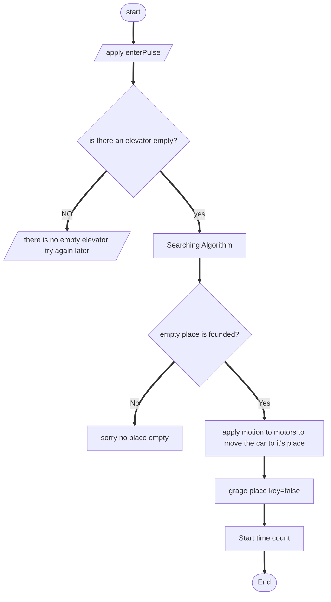
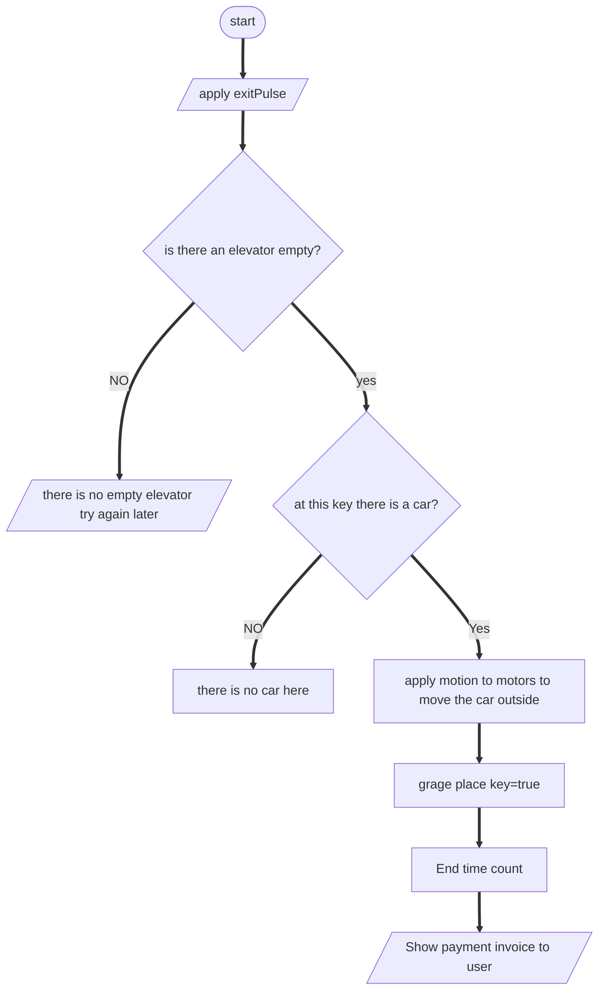

# Smart Garage Project

## 1) Features:

1. Automatic transfer of cars to and from the garage without any human intervention.

2. Make a payment invoice according to the period spent by the car inside the garage

## 2) algo:

### input => Process => Output

enterPulse   |  searching algorithm

isElv_1_Empty

grage places[ ]=true

time count [ ]

exitPulse[]

### Logic to Enter the Garage

### Logic to Exit the Garage

  

